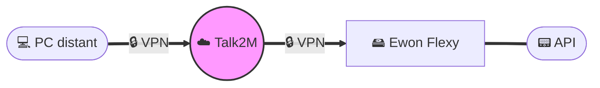

# 📚 Documentation Architectures Industrielles OT/IT

> **Référentiel centralisé** des architectures et solutions d'automatisme industriel **secure by design** de Clauger

[](../../releases/latest)
[](../../actions)
[](LICENSE)

---

## 🎯 Objectif

Ce dépôt centralise les **architectures de référence** pour nos solutions industrielles :
- **Accès distant sécurisé** pour télémaintenance et support
- **Collecte de données** terrain (IoT, énergies, SCADA)
- **Pilotage à distance** d'équipements industriels
- **Modèles contractuels** (consentements GDPR pour données énergétiques)

Les documents servent de **base réutilisable** pour accélérer les **déclinaisons projets clients** tout en garantissant la **conformité sécurité** (ISO 27001, IEC 62443, NIS2).

---

## 📁 Organisation

```
docs/
├── remote-access/          # Solutions d'accès distant
│   ├── ...
│
├── data/                   # Solutions de collecte de données
│   ├── ...
│
├── control/                # Solutions de pilotage
│   └── ...
│
└── legal/                  # Documents contractuels
    ├── Consentement-ENEDIS.*     # Modèles Word/PDF
    ├── Consentement-GRDF.*       # Modèles Word/PDF
    └── Formulaire-type.pdf       # Multi-énergies
```

---

## 🚀 Utilisation

### Consulter les schémas

#### Option 1 : Directement sur GitHub
Les fichiers `.md` avec code Mermaid sont rendus automatiquement dans l'interface GitHub.

#### Option 2 : Dans votre éditeur
- **VS Code** : Extension [Markdown Preview Mermaid Support](https://marketplace.visualstudio.com/items?itemName=bierner.markdown-mermaid)
- **Mermaid Live Editor** : https://mermaid.live

#### Option 3 : Documents générés
Téléchargez les **PDF et PNG** depuis la **[📥 Dernière Release](../../releases/latest)**

### Pour les projets clients

1. **Téléchargez** les PDF/PNG depuis la release
2. **Adaptez** selon le contexte spécifique du client
3. **Validez** les aspects sécurité avec l'équipe cybersécurité
4. **Versionnez** avec un tag `vX.Y.Z` pour traçabilité

---

## 🔧 Technologies & Standards

### Format des schémas
- **Markdown + Mermaid** : Descriptions textuelles versionnables
- **Export automatique** : PNG (présentations) + PDF (documentation)
- **CI/CD** : GitHub Actions pour génération automatique

### Exemple de diagramme Mermaid



### Normes de sécurité intégrées

- **ISO 27001** : Système de management de la sécurité
- **IEC 62443** : Cybersécurité des systèmes industriels
- **NIS2** : Directive européenne sur la cybersécurité
- **RGPD** : Protection des données personnelles

---

## 🤝 Contribution

### Processus

1. **Créez une branche** : `feature/nouvelle-architecture`
2. **Ajoutez/modifiez** les fichiers `.md` avec Mermaid
3. **Documentez** : Contexte, cas d'usage, considérations sécurité
4. **Soumettez une PR** : Review par l'équipe

### Conventions

- **Un schéma = un fichier** pour faciliter la maintenance
- **Nomenclature** : `Solution-Variante.md` (ex: `Accès-distant-Ewon.md`)
- **Structure** : Architecture → Description → Sécurité → Flux réseau
- **Emojis** : Pour la lisibilité (📟 API, 🔒 Sécurisé, ☁️ Cloud, etc.)

### Tests locaux

```bash
# Installation des dépendances
npm install -g @mermaid-js/mermaid-cli

# Génération locale des PNG
mmdc -i docs/remote-access/HMS-Ewon-Talk2M.md -o test.png

# Vérification des markdown
markdownlint docs/**/*.md
```

---

## 📊 Automatisation CI/CD

Le workflow GitHub Actions (`publish-docs.yml`) :
1. **Détecte** les modifications sur `main`
2. **Extrait** les diagrammes Mermaid
3. **Génère** PNG (diagrammes) + PDF (documents complets)
4. **Publie** une release `latest` mise à jour automatiquement

Pour une version figée : créez un tag `vX.Y.Z` → release versionnée automatique

---

## 🔐 Sécurité & Conformité

### Principes appliqués

- **Segmentation réseau** : Zones et conduites (IEC 62443)
- **Authentification forte** : MFA, certificats, API keys
- **Chiffrement** : TLS/MQTTS pour tous les flux
- **Principe du moindre privilège** : Accès limités au strict nécessaire
- **Journalisation** : Traçabilité complète des accès
- **Defense in depth** : Couches de sécurité multiples

### ⚠️ Important

Ces architectures sont des **modèles génériques** qui doivent être :
- **Analysés** selon le contexte spécifique du client
- **Validés** par l'équipe cybersécurité
- **Adaptés** aux contraintes métier et réglementaires
- **Testés** avant mise en production

---

## 📄 Licence

MIT - Voir [LICENSE](LICENSE) pour plus de détails.

Les marques mentionnées (Ewon, Talk2M, etc.) appartiennent à leurs propriétaires respectifs.

---

<div align="center">

**[🏠 Clauger](https://www.clauger.com)** | **[📥 Télécharger les docs](../../releases/latest)** | **[🐛 Signaler un bug](../../issues)**

</div>