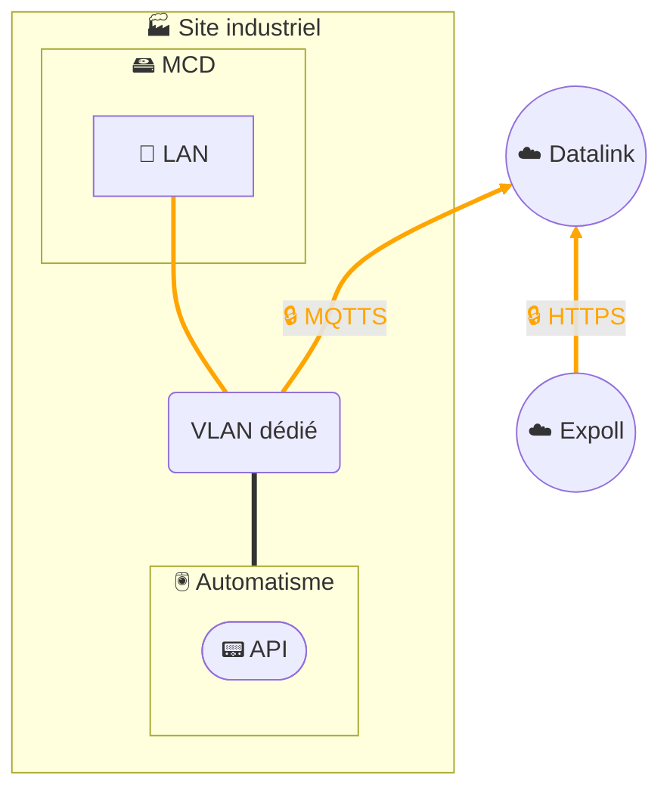
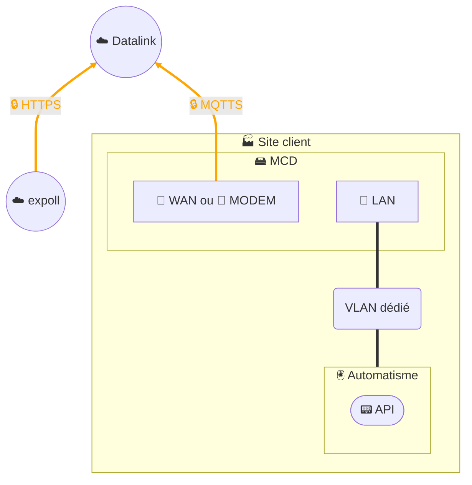

# Pilotage distant - Expoll Drive

## Architecture - 1 seul segment réseau

## Architecture - 2 segments réseau

## Description
La solution **Expoll Drive** permet le **pilotage à distance** d’un équipement **MCD (MyClaugerDetect)** installé sur le site industriel de nos clients, depuis l’application **Expoll** intégrée à notre portail digital **MyPortal3E**.  

Le fonctionnement repose sur une chaîne sécurisée et fiable :  
- L’utilisateur interagit avec l’application **Expoll** depuis MyPortal3E.  
- Les requêtes sont transmises en **HTTPS chiffré** à notre plateforme de **data management Datalink**.  
- Datalink agit comme **maillon intermédiaire** :  
  - l’**API Datalink** expose une ressource spécifique correspondant au device,  
  - le **MCD** s’abonne (subscription à un *topic*) à cette ressource,  
  - les commandes sont ainsi relayées de manière contrôlée vers le MCD.  
- Le **MCD**, via ses applications conteneurisées, exécute localement les actions demandées (collecte, traitement, ou contrôle).  

### Sécurité et fiabilité
- **Chiffrement bout en bout** : HTTPS entre Expoll et Datalink, MQTTS entre Datalink et MCD.  
- **Authentification et autorisations** gérées via l’API Datalink.  
- **Aucune exposition directe du MCD** : les flux sont uniquement sortants depuis le site client vers Datalink, limitant la surface d’attaque.  
- **Résilience et supervision** intégrées dans Datalink pour garantir la fiabilité du service.  

Cette architecture permet de combiner la **souplesse d’un pilotage distant** avec la **sécurité d’une chaîne contrôlée**, en s’intégrant pleinement dans le périmètre de notre SMSI.  
