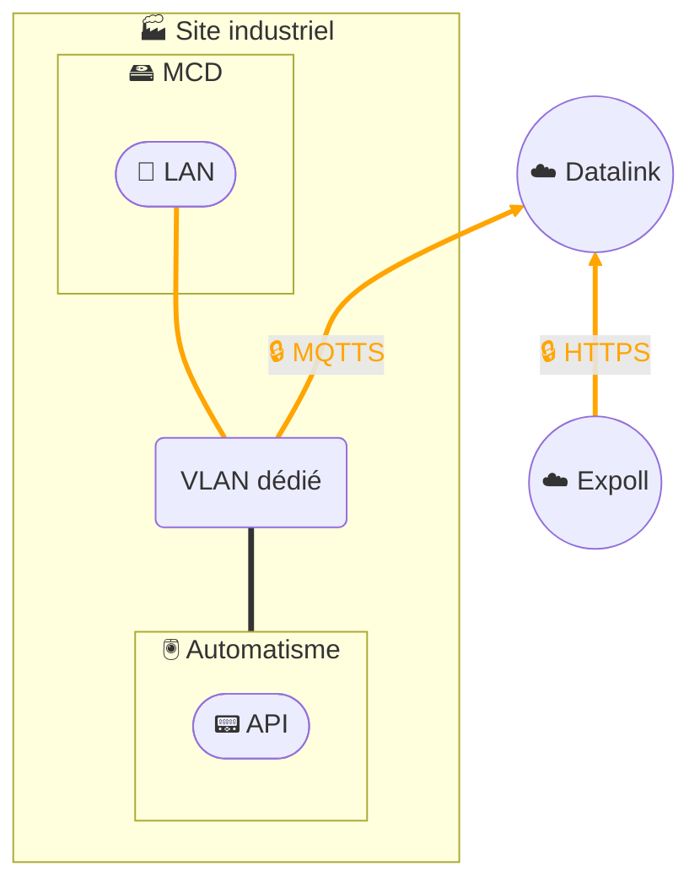
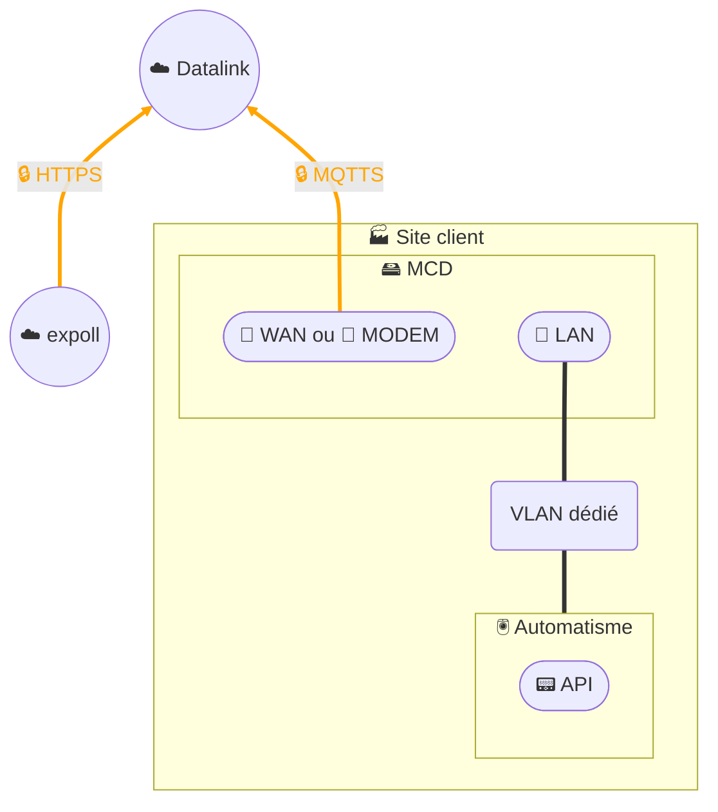

# Pilotage distant - Expoll Drive

## Architecture - 1 seul segment réseau

```mermaid
flowchart BT

    expoll((☁️ Expoll)) == 🔒 HTTPS ==> datalink((☁️ Datalink))
    vlan == 🔒 MQTTS ==> datalink

    subgraph site [🏭 Site industriel]
        subgraph mcd [🖴 MCD]
            mcdLan([🔌 LAN])
        end
        vlan(VLAN dédié)
        subgraph automation [🖲️ Automatisme]
            plc([📟 API])
        end
    end

    automation === vlan
    vlan === mcdLan
    
    linkStyle 0 stroke:orange,stroke-width:3px,color:orange;
    linkStyle 1 stroke:orange,stroke-width:3px,color:orange;
    linkStyle 3 stroke:orange,stroke-width:3px,color:orange;
```

## Architecture - 2 segments réseau

```mermaid
flowchart BT
    expoll((☁️ expoll)) == 🔒 HTTPS ==> datalink((☁️ Datalink))
    mcdWan == 🔒 MQTTS ==>   datalink

    subgraph site [🏭 Site client]
        subgraph mcd [🖴 MCD]
            mcdLan([🔌 LAN])
            mcdWan([🔌 WAN ou 📡 MODEM])
        end
        vlan(VLAN dédié)
        subgraph automation [🖲️ Automatisme]
            plc([📟 API])
        end
    end

    automation === vlan
    vlan === mcdLan
    
    linkStyle 0 stroke:orange,stroke-width:3px,color:orange;
    linkStyle 1 stroke:orange,stroke-width:3px,color:orange;
```

## Description