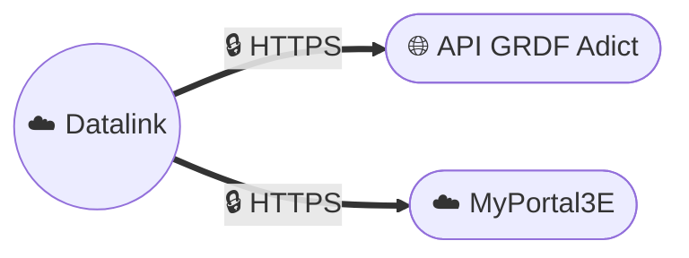

# Collecte de données - API GRDF ADICT (Accès aux Données Individuelles des Clients par des Tiers)

## Architecture

```mermaid
flowchart LR

    datalink((☁️ Datalink)) == 🔒 HTTPS ==> grdf([🌐 API GRDF Adict])
    datalink((☁️ Datalink)) == 🔒 HTTPS ==> myportal3e([☁️ MyPortal3E])

```

## Description