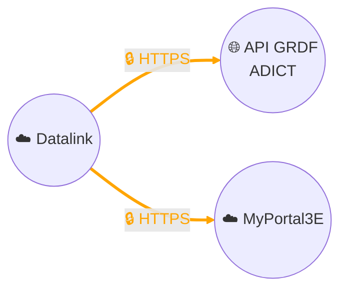

# Collecte de données - API GRDF ADICT (Accès aux Données Individuelles des Clients par des Tiers)

## Architecture

## Description
Nous collectons les données de consommation de gaz de nos clients industriels par le biais de l’**API GRDF ADICT** (Accès aux Données Individuelles des Clients par des Tiers).  
Cette collecte se fait dans le cadre d’un **contrat avec GRDF** et toujours avec le **consentement formel des clients**, conformément au RGPD et aux règles du distributeur.  

La connexion à l’API est sécurisée (protocole HTTPS et authentification OAuth2). Notre plateforme de **data management Datalink (Thinger.io)** interroge l’API GRDF ADICT et met en forme les données. Celles-ci sont ensuite transmises à notre **portail digital MyPortal3E**, où elles sont exploitées et mises à disposition des clients.  

Les données concernées sont les consommations publiées (utilisées pour la facturation), ainsi que des données informatives de suivi (ex. consommations journalières). Elles sont identifiées par le **Point de Comptage et d’Estimation (PCE)**, généralement de la forme `GI + 6 chiffres`.  

- **Profondeur historique** : jusqu’à 5 ans pour les données publiées et 3 ans pour certaines données informatives.  
- **Délais de publication** : selon le type de relève, de **J+1 à J+3 pour les données quotidiennes**, ou jusqu’au **7ᵉ jour ouvré du mois** pour les données mensuelles:contentReference[oaicite:3]{index=3}.  
- **Parcours utilisé** : dans la majorité des cas, le **parcours Tiers Direct**, où nous recueillons directement le consentement du client puis le déclarons à GRDF pour activer l’accès.  

Cette architecture garantit une **chaîne sécurisée de bout en bout** : du recueil du consentement, à la collecte des données par l’API, jusqu’à leur restitution dans MyPortal3E.  
