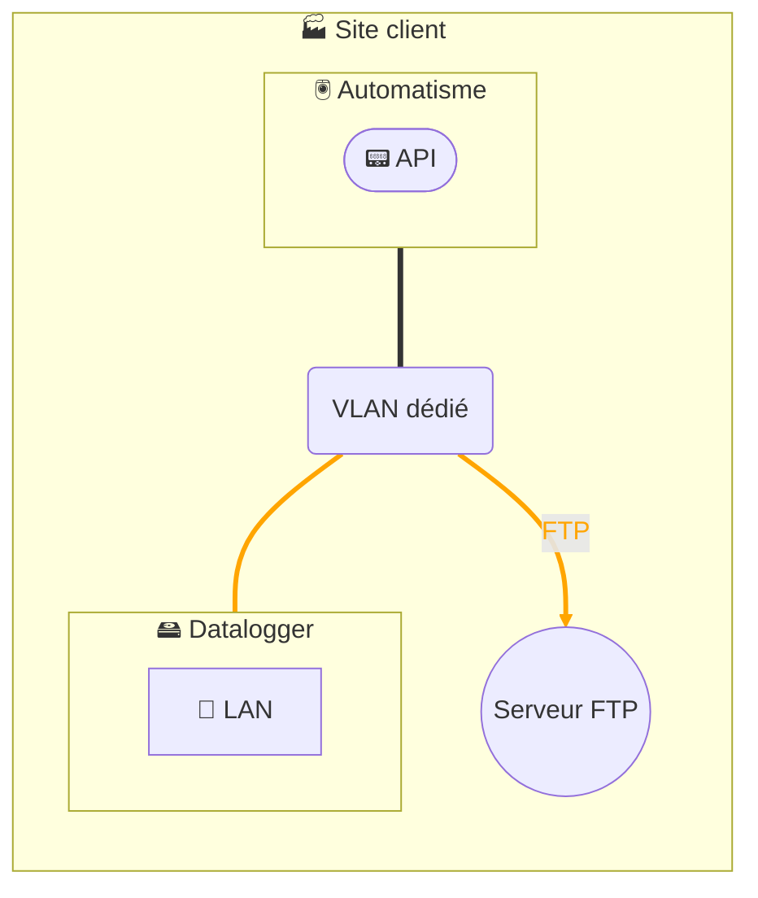

# Collecte de données - Datalogger 1 interface - Seurveur FTP local

## Architecture

## Description
La solution de collecte de données repose sur l’installation d’un **datalogger** industriel chez nos clients.  
Ce datalogger interroge directement les équipements de la zone automatisme via les **protocoles de terrain** (Modbus/TCP, S7, etc.), stocke temporairement les données localement, puis les transmet en **FTP** vers un serveur FTP local.  

Le datalogger est basé sur le produit **HMS Ewon Flexy**, configuré spécifiquement pour la collecte de données :  
- Le datalogger est relié uniquement au réseau automatisme et pousse les données vers un serveur FTP local.

Conformément à notre **politique de sécurité**, la configuration du datalogger est **endurcie** :  
- désactivation des services non utilisés,
- intégration dans notre SMSI certifié ISO 27001, alignée sur IEC 62443 et NIS 2.  

Ainsi, la collecte est **sécurisée, gouvernée et maîtrisée** : seules les données contractuellement définies avec le client sont transmises à une solution locale.  
