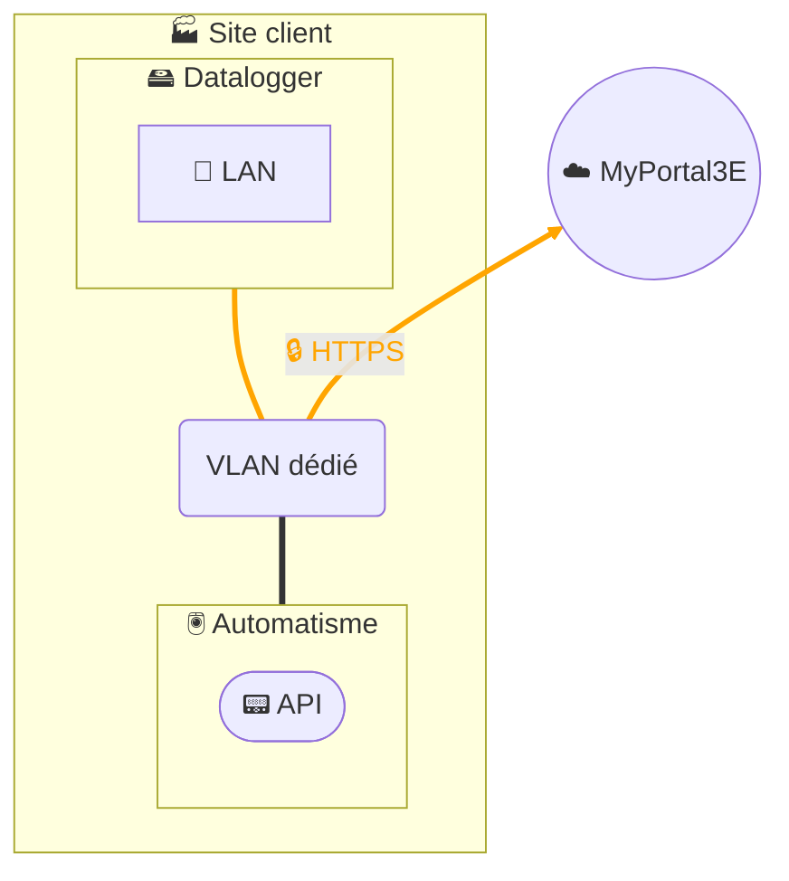

# Collecte de données - Datalogger 1 interface

## Architecture

## Description
La solution de collecte de données repose sur l’installation d’un **datalogger** industriel chez nos clients.  
Ce datalogger interroge directement les équipements de la zone automatisme via les **protocoles de terrain** (Modbus/TCP, S7, etc.), stocke temporairement les données localement, puis les transmet en **HTTPS chiffré** vers notre plateforme digitale **MyPortal3E**.  

Le datalogger est basé sur le produit **HMS Ewon Flexy**, configuré spécifiquement pour la collecte de données :  
- Le datalogger est relié uniquement au réseau automatisme et pousse les données vers Internet via un VLAN ou un proxy existant.
- Dans le cadre de la collecte de données, le datalogger peut être déployé **sans fonction de routage et sans VPN**, afin de limiter la surface d’exposition et de répondre à des besoins de simplicité.  

Conformément à notre **politique de sécurité**, la configuration du datalogger est **endurcie** :  
- désactivation des services non utilisés,
- protection des flux sortants (*outbound only*),
- intégration dans notre SMSI certifié ISO 27001, alignée sur IEC 62443 et NIS 2.  

Ainsi, la collecte est **sécurisée, gouvernée et maîtrisée** : seules les données contractuellement définies avec le client sont transmises, via un canal chiffré TLS, vers notre infrastructure MyPortal3E hébergée de manière conforme à notre SMSI.  
