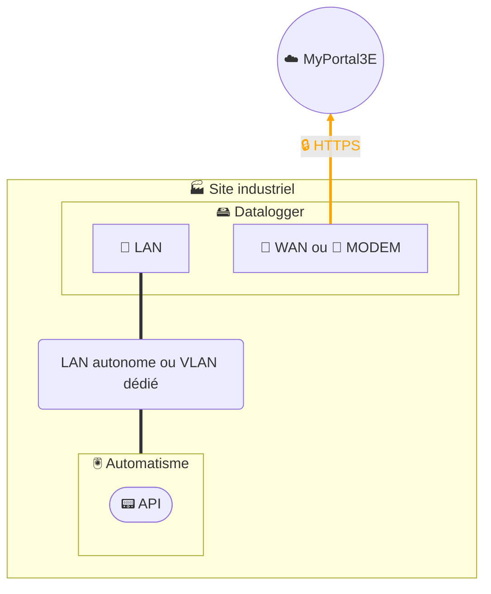

# Collecte de données - Datalogger 2 interfaces

## Architecture

## Description
La solution de collecte de données repose sur l’installation d’un **datalogger** industriel chez nos clients.  
Ce datalogger interroge directement les équipements de la zone automatisme via les **protocoles de terrain** (Modbus/TCP, S7, etc.), stocke temporairement les données localement, puis les transmet en **HTTPS chiffré** vers notre plateforme digitale **MyPortal3E**.  

Le datalogger est basé sur le produit **HMS Ewon Flexy**, configuré spécifiquement pour la collecte de données :  
- Le datalogger assure la **segmentation entre réseau industriel et réseau externe**. Dans ce cas, l’interface WAN peut être connectée soit au réseau IT client, soit à un modem 4G, et la fonction VPN peut être activée si nécessaire.  
- Dans le cadre de la collecte de données, le datalogger peut être déployé **sans fonction de routage et sans VPN**, afin de limiter la surface d’exposition et de répondre à des besoins de simplicité.  

Conformément à notre **politique de sécurité**, la configuration du datalogger est **endurcie** :  
- désactivation des services non utilisés,  
- séparation stricte LAN/WAN lorsque applicable,  
- protection des flux sortants (*outbound only*),  
- mise à jour régulière des firmwares et gestion proactive des vulnérabilités,  
- authentification et gestion des comptes selon le principe du moindre privilège,  
- intégration dans notre SMSI certifié ISO 27001, alignée sur IEC 62443 et NIS 2.  

Ainsi, la collecte est **sécurisée, gouvernée et maîtrisée** : seules les données contractuellement définies avec le client sont transmises, via un canal chiffré TLS, vers notre infrastructure MyPortal3E hébergée de manière conforme à notre SMSI.  
