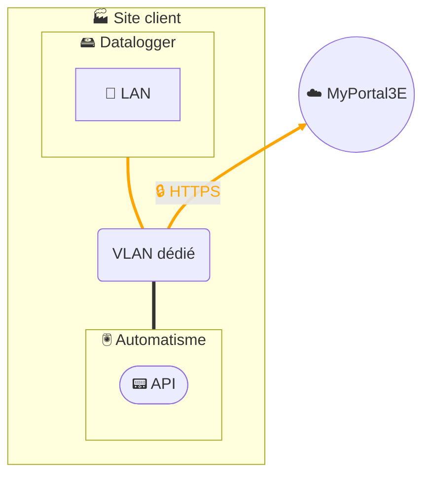
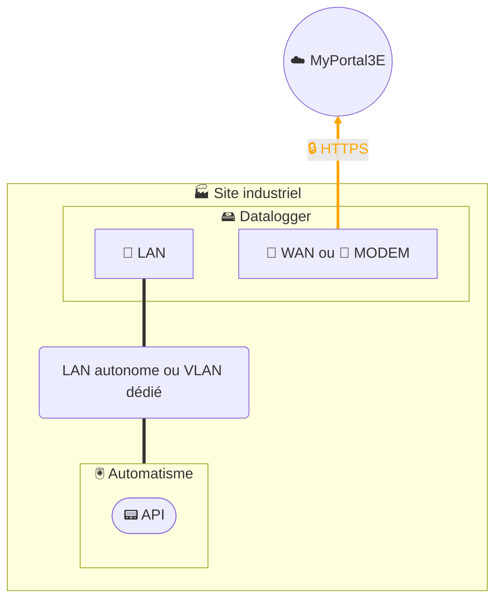

# Collecte de données - Datalogger

## Architecture - 1 seul segment réseau

```mermaid
flowchart BT

    subgraph site [🏭 Site client]
        subgraph automation [🖲️ Automatisme]
            plc([📟 API])
        end

        vlan(VLAN dédié)
        
        subgraph ewon [🖴 Datalogger]
            ewonLan[🔌 LAN]
        end
    end

    myportal3e((☁️ MyPortal3E))

    vlan == 🔒 HTTPS ==> myportal3e
    automation === vlan
    vlan === ewon
    
    linkStyle 0 stroke:orange,stroke-width:3px,color:orange;
    linkStyle 2 stroke:orange,stroke-width:3px,color:orange;
```

## Architecture - 2 segments réseau

```mermaid
flowchart BT

    subgraph site [🏭 Site industriel]
        subgraph automation [🖲️ Automatisme]
            plc([📟 API])
        end

        vlan(LAN autonome ou VLAN dédié)
        
        subgraph ewon [🖴 Datalogger]
            ewonLan[🔌 LAN]
            ewonWan[🔌 WAN ou 📡 MODEM]
        end
    end

    myportal3e((☁️ MyPortal3E))

    ewonWan == 🔒 HTTPS ==> myportal3e
    automation === vlan
    vlan === ewonLan
    
    linkStyle 0 stroke:orange,stroke-width:3px,color:orange;
```

## Description