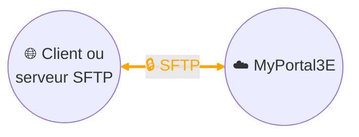

# Collecte de données - Echange de fichiers par SFTP

## Architecture

## Description
Notre plateforme digitale **MyPortal3E** permet l’échange de données avec les systèmes de nos clients industriels au travers du protocole **SFTP** (*Secure File Transfer Protocol*).  

Cet échange repose sur le transfert de **fichiers CSV** contenant les données métier définies dans le cadre de la gouvernance client.  
- En amont du projet, le **format exact du fichier CSV** (structure, en-têtes, séparateurs, périodicité) est défini conjointement avec le client afin de garantir l’interopérabilité.  
- Deux modes d’échange sont possibles :  
  1. **Le client industriel héberge le serveur SFTP** : MyPortal3E vient y récupérer les fichiers CSV et se charge ensuite de les **supprimer après récupération**, afin d’éviter les doublons ou l’accumulation de fichiers.  
  2. **MyPortal3E héberge le service SFTP** : le client agit en tant que « client SFTP » et pousse régulièrement les nouveaux fichiers CSV, assurant ainsi la **fraîcheur des données** disponibles côté Portail.  

Le protocole **SFTP** garantit la sécurité des échanges grâce :  
- au **chiffrement des communications**, qui protège la confidentialité et l’intégrité des données,  
- à une **authentification forte** (compte dédié, mot de passe robuste et/ou clé SSH).  

Cette architecture permet une intégration simple et sécurisée, tout en respectant la responsabilité de gouvernance du client sur les données fournies.  
