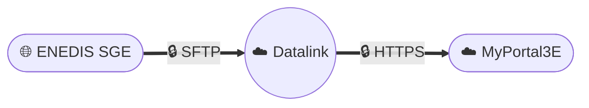

# Collecte de données - ENEDIS SGE (Système de Gestion des Echanges)

## Architecture

```mermaid
flowchart LR

    enedis([🌐 ENEDIS SGE]) == 🔒 SFTP ==> datalink((☁️ Datalink))
    datalink((☁️ Datalink)) == 🔒 HTTPS ==> myportal3e([☁️ MyPortal3E])

```

## Description