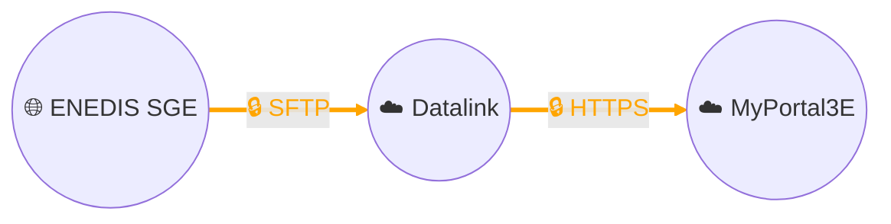

# Collecte de données - ENEDIS SGE (Système de Gestion des Echanges)

## Architecture

## Description
Nous avons contractualisé avec le distributeur d’énergie **Enedis** l’accès aux données de consommation électrique de nos clients industriels, sous réserve de leur **autorisation et consentement formel**.  

Chaque jour, les données de consommation et les **courbes de charge** sont déposées par Enedis sur un **serveur SFTP** dédié de notre plateforme de **data management Datalink**.  
Ces fichiers sont ensuite transformés, normalisés et enrichis par Datalink avant d’être transmis en **HTTPS chiffré** vers notre plateforme digitale **MyPortal3E**, où elles sont exploitées pour le suivi énergétique et la valorisation des performances.  

Les données mises à disposition par Enedis sont identifiées par le **Point de Référence de Mesure (PRM)**, un identifiant unique de **14 chiffres** attribué à chaque point de livraison d’électricité.  

### Profondeurs historiques des données
- **Flux récurrent index (consommation)** : profondeur historique de 3 ans.  
- **Flux récurrent courbe de charge (demi-heure, quart d’heure ou 10 minutes selon contrat)** : profondeur historique de 24 mois.  

### Délais de publication
- Les **index journaliers** sont disponibles en général sous **J+1 à J+3** selon le mode de relève.  
- Les **courbes de charge** sont publiées quotidiennement avec un décalage similaire.  

### Sécurité et conformité
Cette solution est **sécurisée de bout en bout** :  
- **SFTP** garantit le chiffrement et l’intégrité des fichiers transférés entre Enedis et Datalink.  
- **HTTPS/TLS** assure la protection des flux entre Datalink et MyPortal3E.  
- Les flux sont gouvernés et tracés, et seuls les clients ayant donné leur consentement peuvent être intégrés dans le dispositif.  

Pour plus d’informations techniques et fonctionnelles, voir la documentation officielle Enedis :  
[Portail DataHub Enedis](https://datahub-enedis.fr/)
