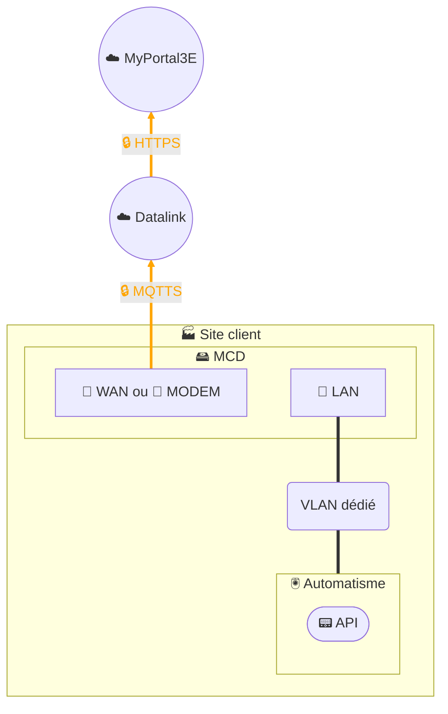

# Collecte de données - MCD (MyClaugerDetect)

## Architecture - 1 seul segment réseau

## Architecture - 2 segments réseau

## Description
La solution **MyClaugerDetect (MCD)** repose sur l’installation d’un **PC industriel sous Linux**, équipé d’applications **conteneurisées** permettant de collecter et d’enrichir localement les données issues des réseaux d’automatisme.  

Le MCD interroge les équipements via les **protocoles de terrain** (API/PLC, IHM, capteurs), traite et structure les données, puis les transmet de manière **sécurisée et chiffrée** en utilisant le protocole **MQTTS** vers notre plateforme de **data management Datalink**.  
Datalink assure ensuite la transformation, la gouvernance et la supervision des flux avant de restituer les données en **HTTPS chiffré** vers notre plateforme digitale **MyPortal3E**.  

Caractéristiques principales :  
- Pas de fonction VPN : le MCD est limité à la collecte et au traitement local de la donnée.  
- Architecture possible en **1 seul segment réseau** (LAN dédié) ou en **2 segments** (LAN + WAN/modem) pour assurer la segmentation et renforcer la sécurité.  
- Les conteneurs applicatifs permettent une **flexibilité et une évolutivité** dans l’intégration de nouvelles fonctionnalités ou connecteurs.  
- L’ensemble de la solution est intégré dans le périmètre de notre **SMSI certifié ISO 27001**, en alignement avec les référentiels **IEC 62443** et **NIS 2**.  

Cette architecture garantit une chaîne de collecte **sécurisée de bout en bout**, depuis le terrain jusqu’au portail MyPortal3E, avec un contrôle strict des flux et des responsabilités de gouvernance clairement établies.  
