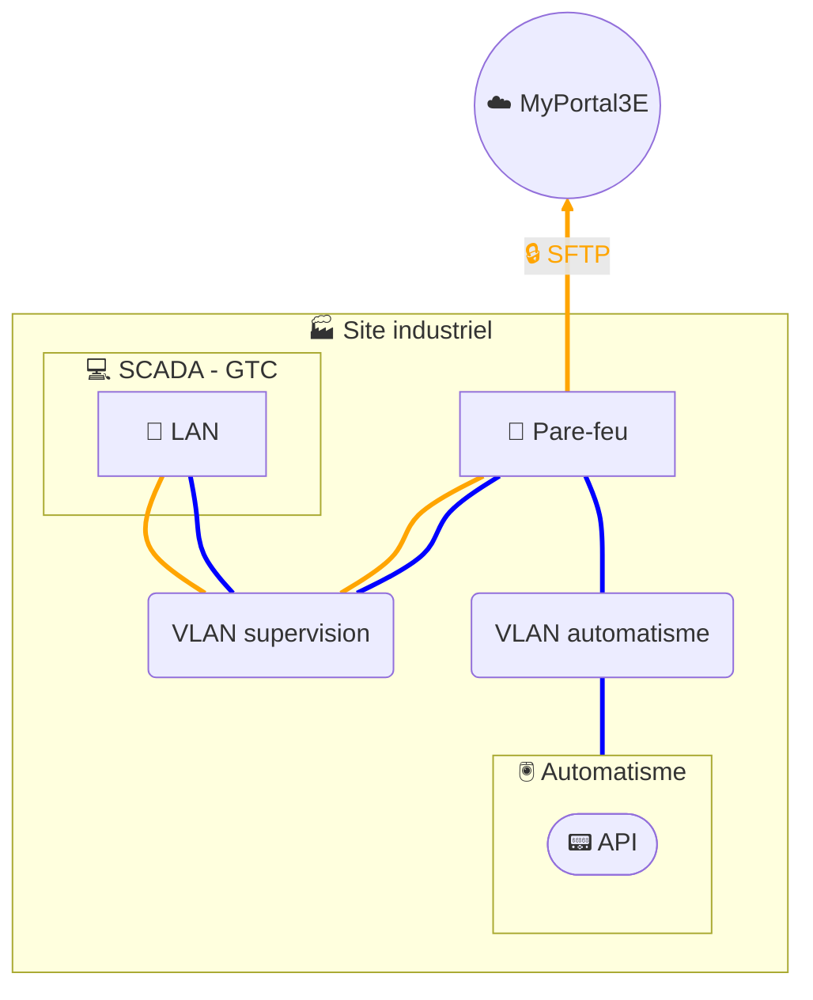

# Collecte de données - SCADA SFTP

## Architecture

## Description
Dans cette architecture, la collecte de données est réalisée à partir de la solution **SCADA/GTC** (poste physique ou virtuel avec application de supervision).  
Un script interne au SCADA extrait périodiquement les données de production et génère des **fichiers CSV**. Ces fichiers sont ensuite transférés de manière automatique vers notre plateforme digitale **MyPortal3E** via un envoi **SFTP sécurisé** (authentification + chiffrement), grâce à un script **PowerShell** et une **tâche planifiée** exécutée sur le poste SCADA.  

L’architecture distingue deux types de flux :  
- En **orange** : le transfert sécurisé des données (CSV → SFTP → MyPortal3E).  
- En **bleu** : la collecte locale des données sur l’automatisme par le SCADA.  

Pour des raisons de cybersécurité, il est recommandé de disposer le **SCADA/GTC sur un segment réseau distinct** de celui de l’automatisme. Cela permet de contrôler les échanges entre ces deux zones de sécurité (Security Layers – SL), en appliquant des règles de pare-feu restrictives et une séparation claire des rôles entre supervision et contrôle-commande.  

Cette solution permet ainsi :  
- une **collecte automatisée et fiable** des données,  
- un **transfert sécurisé et gouverné** vers MyPortal3E,  
- et une **réduction de la surface d’attaque** grâce à la segmentation réseau et au filtrage des flux.  
