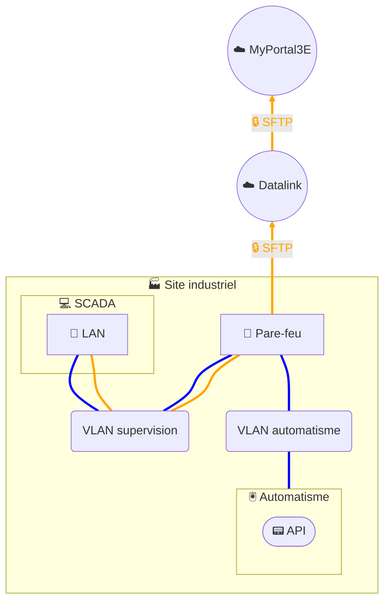

# Collecte de données - SCADA SFTP

## Architecture

```mermaid
flowchart BT

    subgraph site [🏭 Site industriel]

        fw[🧱 Pare-feu]

        subgraph automation [🖲️ Automatisme]
            plc([📟 API])
        end

        vlanScada(VLAN supervision)
        vlanPlc(VLAN automatisme)
        
        subgraph scada [💻 SCADA]
            scadaLan[🔌 LAN]
        end
    end

    myportal3e((☁️ MyPortal3E))

    fw == 🔒 SFTP ==> datalink((☁️ Datalink)) == 🔒 SFTP ==> myportal3e((☁️ MyPortal3E))
    automation === vlanPlc
    vlanScada === scadaLan
    vlanPlc === fw
    vlanScada === fw

    vlanScada --- scadaLan
    vlanScada --- fw
    
    linkStyle 0 stroke:orange,stroke-width:3px,color:orange;
    linkStyle 1 stroke:orange,stroke-width:3px,color:orange;
    linkStyle 3 stroke:orange,stroke-width:3px,color:orange;
    linkStyle 5 stroke:orange,stroke-width:3px,color:orange;
    
    linkStyle 4 stroke:blue,stroke-width:3px,color:blue;
    linkStyle 2 stroke:blue,stroke-width:3px,color:blue;
    linkStyle 6 stroke:blue,stroke-width:3px,color:blue;
    linkStyle 7 stroke:blue,stroke-width:3px,color:blue;
```

## Description