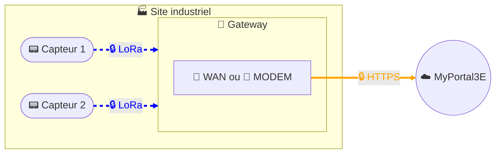

# Collecte de données - Solution LoRaWAN privé

## Architecture

```mermaid
flowchart LR

    subgraph site [🏭 Site industriel]
        
        subgraph gw [📡 Gateway]
            gwWan[🔌 WAN ou 📡 MODEM]
        end
        sensor1([📟 Capteur 1]) == 🔒 LoRa ==> gw
        sensor2([📟 Capteur 2]) == 🔒 LoRa ==> gw
    end

    gwWan == 🔒 HTTPS ==> myportal3e((☁️ MyPortal3E))

    linkStyle 0 stroke:blue,stroke-width:3px,stroke-dasharray: 5 5 ,color:blue;
    linkStyle 1 stroke:blue,stroke-width:3px,stroke-dasharray: 5 5 ,color:blue;
    linkStyle 2 stroke:orange,stroke-width:3px,color:orange;
```

## Description