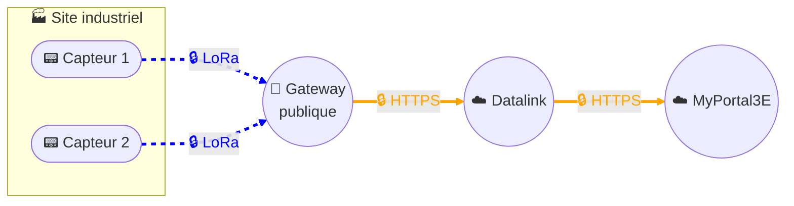

# Collecte de données - Solution LoRaWAN public

## Architecture

## Description
Cette architecture repose sur une solution de collecte de données **LoRaWAN publique**, mise en œuvre via une **contractualisation avec Orange** pour l’utilisation de la plateforme **LiveObjects**.  

Les capteurs, généralement alimentés par batterie, transmettent leurs mesures en utilisant le protocole radio **LoRa** vers une **Gateway publique opérée par Orange**.  
Les données sont ensuite routées et traitées par **LiveObjects**, puis transitent de manière sécurisée par notre plateforme de **data management Datalink** avant d’être restituées en **HTTPS chiffré** vers notre **portail digital MyPortal3E**.  

### Sécurité
La solution est sécurisée de bout en bout :  
- Authentification et chiffrement natifs de LoRaWAN pour la communication capteur ↔ réseau.  
- Transmission sécurisée (HTTPS, MQTTS, Websocket over TLS, etc.) entre la Gateway/LiveObjects et nos systèmes.  
- LiveObjects suit un processus **security- and privacy-by-design** inspiré des normes ISO 27000, avec des audits réguliers, une supervision continue et une amélioration permanente.  
- Les données sont hébergées en France (AWS Paris) et chiffrées en transit comme au repos.  
- La configuration des API keys et certificats relève d’une **responsabilité partagée** : Orange assure la sécurité de l’infrastructure et des services, tandis que nous gérons les clés et l’authentification de nos objets et applications.  

### Gouvernance et contrat
- Cette solution est proposée **sous abonnement**, avec un **coût par capteur et par mois**, défini dans le contrat avec Orange.  
- **Aucune rétention des données côté Orange** : les flux sont immédiatement routés vers notre plateforme Datalink, qui assure le traitement et la supervision des flux.  
- La **conservation et l’hébergement des données** sont réalisés exclusivement sur **MyPortal3E**, dans le cadre de notre gouvernance interne.  

## Avantages clés
- Autonomie énergétique : capteurs sur batterie, faible consommation.  
- Collecte sans fil et non intrusive : pas d’impact sur le réseau client.  
- Pas de Gateway locale : connectivité assurée par l’opérateur Orange.  
- Sécurité renforcée : Join-OTA, chiffrement des flux, supervision et audits réguliers.  
- Hébergement en France (AWS Paris) côté Orange pour le transport, conservation finale dans MyPortal3E.  
- Intégration fluide : les données transitent par Datalink avant restitution et conservation sécurisée dans MyPortal3E.  
