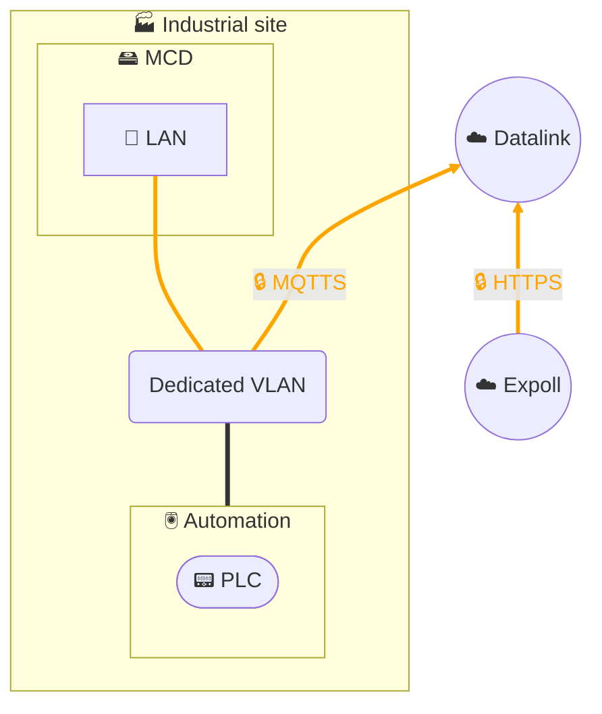
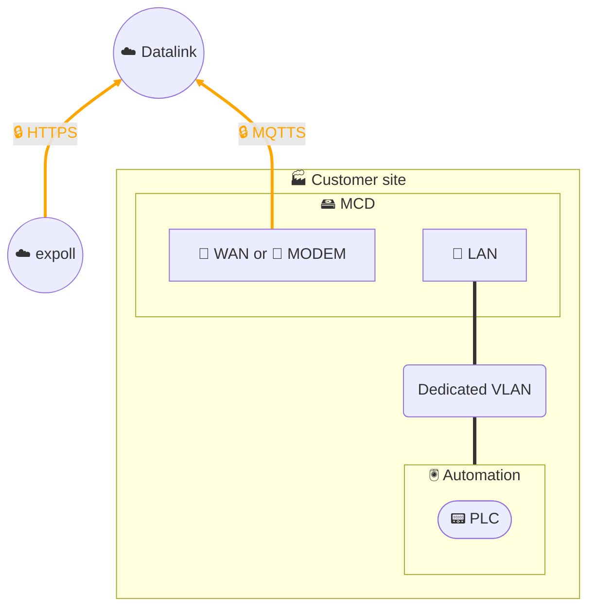

# Remote control - Expoll Drive

## Architecture - Single network segment

## Architecture - 2 network segments

## Description
The **Expoll Drive** solution enables **remote control** of an **MCD (MyClaugerDetect)** device installed at our customers' industrial sites, from the **Expoll** application integrated into our **MyPortal3E** digital portal.

Operation relies on a secure and reliable chain:
- The user interacts with the **Expoll** application from MyPortal3E.
- Requests are transmitted via **encrypted HTTPS** to our **Datalink data management platform**.
- Datalink acts as an **intermediate link**:
  - the **Datalink API** exposes a specific resource corresponding to the device,
  - the **MCD** subscribes (subscription to a *topic*) to this resource,
  - commands are thus relayed in a controlled manner to the MCD.
- The **MCD**, via its containerized applications, locally executes the requested actions (collection, processing, or control).

### Security and reliability
- **End-to-end encryption**: HTTPS between Expoll and Datalink, MQTTS between Datalink and MCD.
- **Authentication and authorizations** managed via the Datalink API.
- **No direct MCD exposure**: flows are outbound only from the customer site to Datalink, limiting the attack surface.
- **Resilience and monitoring** integrated into Datalink to ensure service reliability.

This architecture combines the **flexibility of remote control** with the **security of a controlled chain**, fully integrated within our ISMS perimeter.
