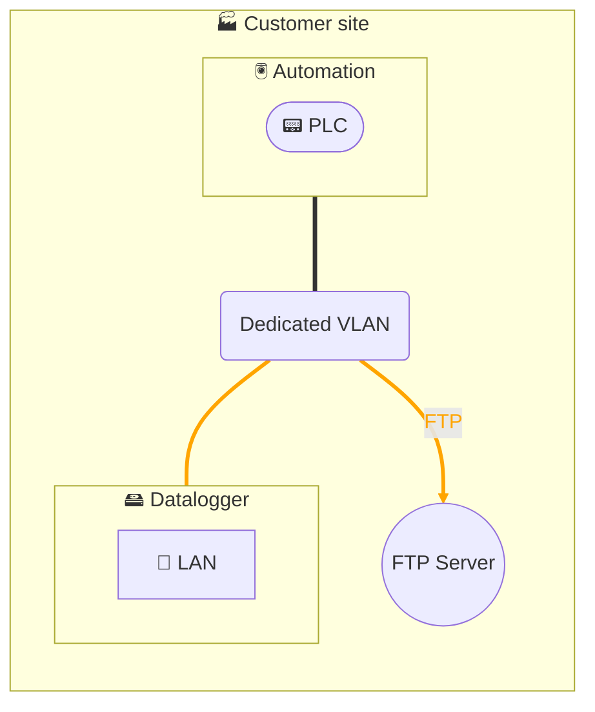

# Data collection - Datalogger 1 interface - Local FTP server

## Architecture

## Description
The data collection solution is based on installing an industrial **datalogger** at our customers' sites.
This datalogger directly queries equipment in the automation zone via **field protocols** (Modbus/TCP, S7, etc.), temporarily stores data locally, then transmits it via **FTP** to a local FTP server.

The datalogger is based on the **HMS Ewon Flexy** product, specifically configured for data collection:
- The datalogger is connected only to the automation network and pushes data to a local FTP server.

In accordance with our **security policy**, the datalogger configuration is **hardened**:
- disabling unused services,
- integration into our ISO 27001 certified ISMS, aligned with IEC 62443 and NIS 2.

Thus, collection is **secure, governed, and controlled**: only data contractually defined with the customer is transmitted to a local solution.
