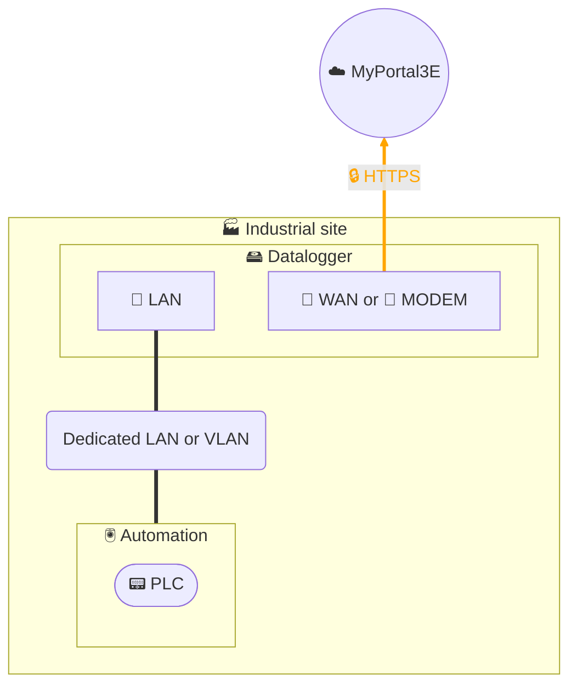

# Data collection - Datalogger 2 interfaces

## Architecture

## Description
The data collection solution is based on installing an industrial **datalogger** at our customers' sites.
This datalogger directly queries equipment in the automation zone via **field protocols** (Modbus/TCP, S7, etc.), temporarily stores data locally, then transmits it via **encrypted HTTPS** to our **MyPortal3E** digital platform.

The datalogger is based on the **HMS Ewon Flexy** product, specifically configured for data collection:
- The datalogger ensures **segmentation between industrial network and external network**. In this case, the WAN interface can be connected either to the customer's IT network or to a 4G modem, and VPN functionality can be enabled if necessary.
- For data collection purposes, the datalogger can be deployed **without routing function and without VPN**, to limit the exposure surface and meet simplicity requirements.

In accordance with our **security policy**, the datalogger configuration is **hardened**:
- disabling unused services,
- strict LAN/WAN separation when applicable,
- outbound-only flow protection,
- regular firmware updates and proactive vulnerability management,
- authentication and account management according to the principle of least privilege,
- integration into our ISO 27001 certified ISMS, aligned with IEC 62443 and NIS 2.

Thus, collection is **secure, governed, and controlled**: only data contractually defined with the customer is transmitted, via a TLS encrypted channel, to our MyPortal3E infrastructure hosted in compliance with our ISMS.
