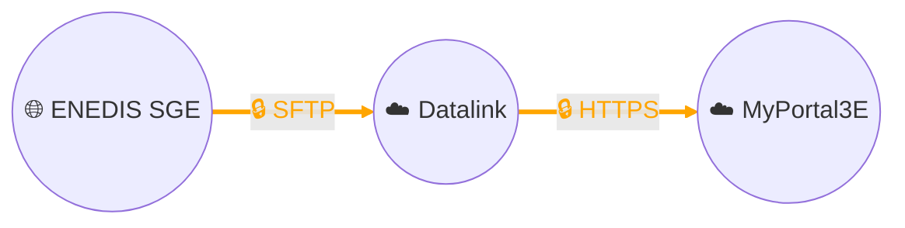

# Data collection - ENEDIS SGE (Exchange Management System)

## Architecture

## Description
We have contracted with the energy distributor **Enedis** for access to electrical consumption data from our industrial customers, subject to their **authorization and formal consent**.

Each day, consumption data and **load curves** are deposited by Enedis on a **dedicated SFTP server** of our **Datalink data management platform**.
These files are then transformed, normalized, and enriched by Datalink before being transmitted via **encrypted HTTPS** to our **MyPortal3E digital platform**, where they are used for energy monitoring and performance optimization.

The data provided by Enedis is identified by the **Measurement Reference Point (PRM)**, a unique **14-digit identifier** assigned to each electricity delivery point.

### Historical data depths
- **Recurring index flow (consumption)**: 3-year historical depth.
- **Recurring load curve flow (half-hour, quarter-hour, or 10-minute intervals depending on contract)**: 24-month historical depth.

### Publication delays
- **Daily indexes** are generally available within **D+1 to D+3** depending on the reading method.
- **Load curves** are published daily with a similar delay.

### Security and compliance
This solution is **secured end-to-end**:
- **SFTP** ensures encryption and integrity of files transferred between Enedis and Datalink.
- **HTTPS/TLS** ensures protection of flows between Datalink and MyPortal3E.
- Flows are governed and tracked, and only customers who have given their consent can be integrated into the system.

For more technical and functional information, see the official Enedis documentation:
[Enedis DataHub Portal](https://datahub-enedis.fr/)
