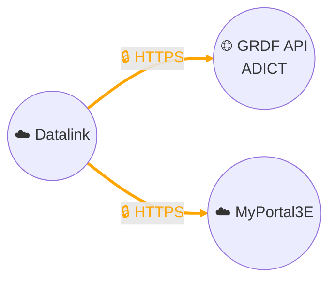

# Data collection - GRDF ADICT API (Third-Party Access to Individual Customer Data)

## Architecture

## Description
We collect gas consumption data from our industrial customers through the **GRDF ADICT API** (Third-Party Access to Individual Customer Data).
This collection is carried out under a **contract with GRDF** and always with the **formal consent of customers**, in compliance with GDPR and distributor rules.

The API connection is secured (HTTPS protocol and OAuth2 authentication). Our **Datalink data management platform (Thinger.io)** queries the GRDF ADICT API and formats the data. This data is then transmitted to our **MyPortal3E digital portal**, where it is processed and made available to customers.

The data concerned includes published consumption (used for billing), as well as informative tracking data (e.g., daily consumption). They are identified by the **Metering and Estimation Point (PCE)**, generally in the form `GI + 6 digits`.

- **Historical depth**: up to 5 years for published data and 3 years for certain informative data.
- **Publication delays**: depending on the type of reading, from **D+1 to D+3 for daily data**, or up to the **7th business day of the month** for monthly data.
- **Process used**: in most cases, the **Direct Third-Party process**, where we directly collect customer consent and then declare it to GRDF to activate access.

This architecture guarantees a **secure end-to-end chain**: from consent collection, to data retrieval via the API, to delivery in MyPortal3E.

For more technical and functional information, see the official GRDF documentation:
[GRDF ADICT API Portal](https://sites.grdf.fr/web/portail-api-grdf-adict)
