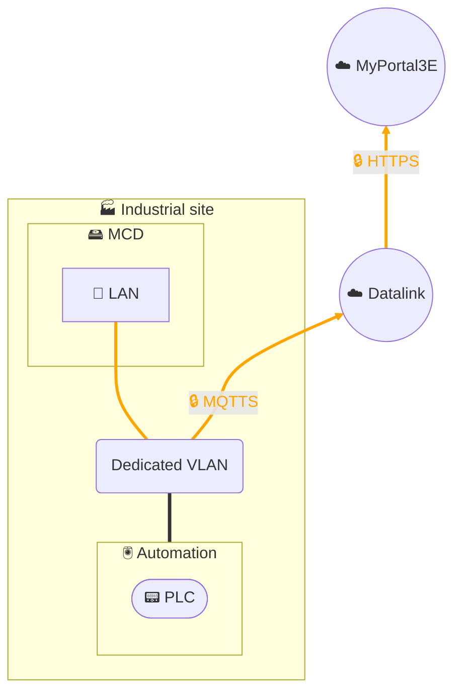
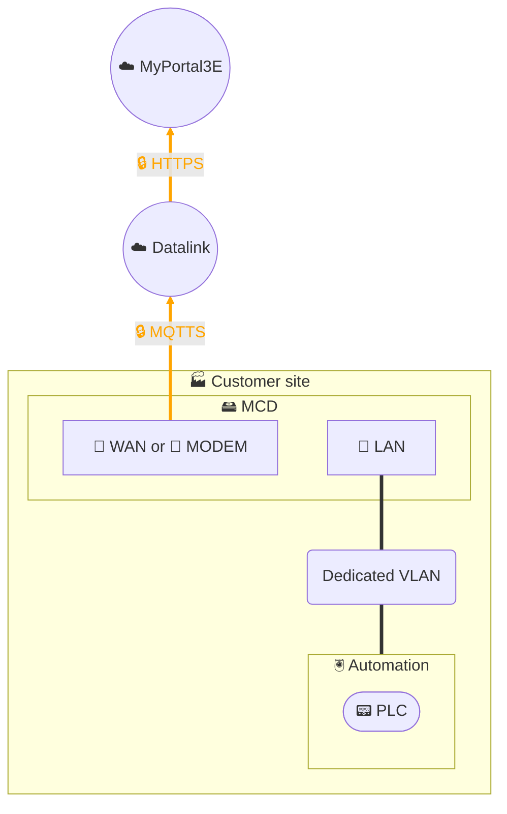

# Data collection - MCD (MyClaugerDetect)

## Architecture - Single network segment

## Architecture - 2 network segments

## Description
The **MyClaugerDetect (MCD)** solution is based on installing an **industrial Linux PC**, equipped with **containerized applications** for collecting and locally enriching data from automation networks.

The MCD queries equipment via **field protocols** (PLC, HMI, sensors), processes and structures the data, then transmits it **securely and encrypted** using the **MQTTS** protocol to our **Datalink data management platform**.
Datalink then handles transformation, governance, and flow monitoring before delivering the data via **encrypted HTTPS** to our **MyPortal3E** digital platform.

Key features:
- No VPN function: the MCD is limited to local data collection and processing.
- Architecture possible in **single network segment** (dedicated LAN) or in **2 segments** (LAN + WAN/modem) to ensure segmentation and enhance security.
- Application containers enable **flexibility and scalability** in integrating new features or connectors.
- The entire solution is integrated within our **ISO 27001 certified ISMS** perimeter, aligned with **IEC 62443** and **NIS 2** frameworks.

This architecture guarantees an **end-to-end secure collection chain**, from the field to the MyPortal3E portal, with strict flow control and clearly established governance responsibilities.
