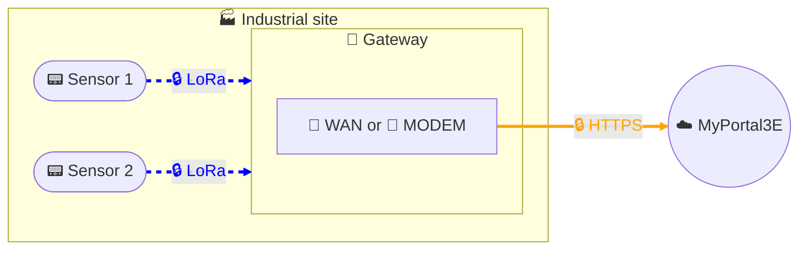

# Data collection - Private LoRaWAN solution

## Architecture

## Description
This architecture implements a wireless LoRaWAN data collection solution adapted to industrial environments.
The sensors, generally battery-powered, transmit their measurements using the LoRa radio protocol to a private LoRaWAN Gateway provided as part of the solution.

The Gateway acts as a local collection point and securely relays data to our MyPortal3E digital platform:
- Sensors join the network via the secure Join-OTA (Over The Air Activation) procedure, ensuring authenticity and confidentiality of radio exchanges.
- The Gateway then transmits data via encrypted HTTPS to MyPortal3E, either:
  - via mobile Internet access (Orange network in extended Europe),
  - or via customer network, with strictly controlled outbound flows.

For cybersecurity reasons, Gateway configuration is hardened:
- use of a unique and protected local account,
- attack surface reduction by disabling unused services,
- strict connectivity limitation (outbound flows only to authorized services).

This solution is autonomous and non-intrusive with respect to the customer's IS or network, while ensuring secure end-to-end collection, from sensor to MyPortal3E platform.

## Key benefits
- Energy autonomy: battery-powered sensors, low consumption.
- Long-range wireless connectivity: LoRa protocol adapted to industrial environments.
- Non-intrusive: no impact on customer IS or network.
- Enhanced security: Join-OTA, HTTPS encryption, Gateway hardening.
- Deployment flexibility: transmission via mobile Internet (extended Europe) or customer network.
- Ease of implementation: quick installation, no additional cabling.
