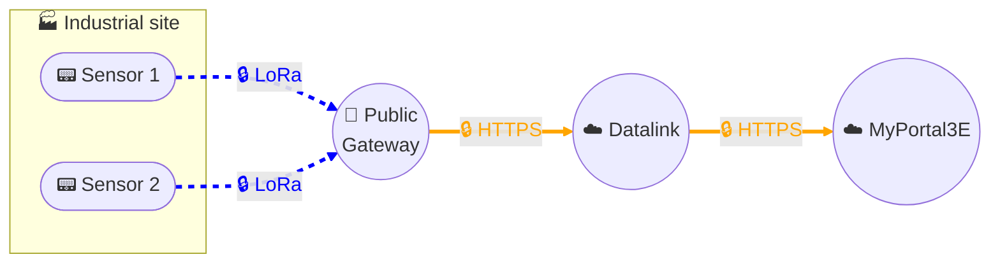

# Data collection - Public LoRaWAN solution

## Architecture

## Description
This architecture is based on a **public LoRaWAN** data collection solution, implemented through a **contract with Orange** for the use of the **LiveObjects** platform.

The sensors, generally battery-powered, transmit their measurements using the **LoRa** radio protocol to a **public Gateway operated by Orange**.
The data is then routed and processed by **LiveObjects**, then securely transits through our **Datalink data management platform** before being delivered via **encrypted HTTPS** to our **MyPortal3E digital portal**.

### Security
The solution is secured end-to-end:
- Native LoRaWAN authentication and encryption for sensor ↔ network communication.
- Secure transmission (HTTPS, MQTTS, Websocket over TLS, etc.) between the Gateway/LiveObjects and our systems.
- LiveObjects follows a **security- and privacy-by-design** process inspired by ISO 27000 standards, with regular audits, continuous monitoring, and ongoing improvement.
- Data is hosted in France (AWS Paris) and encrypted in transit and at rest.
- API key and certificate configuration is a **shared responsibility**: Orange ensures the security of infrastructure and services, while we manage keys and authentication for our objects and applications.

### Governance and contract
- This solution is offered **on a subscription basis**, with a **cost per sensor per month**, defined in the contract with Orange.
- **No data retention on Orange's side**: flows are immediately routed to our Datalink platform, which handles processing and flow monitoring.
- **Data storage and hosting** are performed exclusively on **MyPortal3E**, within our internal governance framework.

## Key benefits
- Energy autonomy: battery-powered sensors, low consumption.
- Wireless and non-intrusive collection: no impact on customer network.
- No local Gateway: connectivity provided by Orange operator.
- Enhanced security: Join-OTA, flow encryption, monitoring, and regular audits.
- Hosting in France (AWS Paris) on Orange's side for transport, final storage in MyPortal3E.
- Seamless integration: data transits through Datalink before secure delivery and storage in MyPortal3E.
