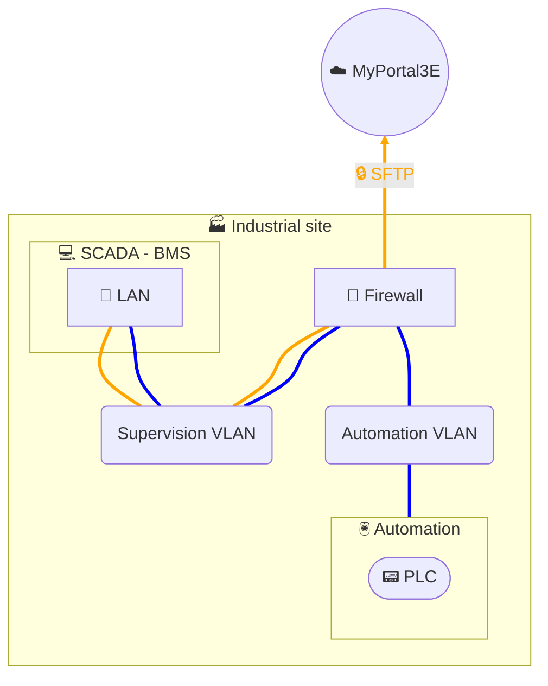

# Data collection - SCADA SFTP

## Architecture

## Description
In this architecture, data collection is performed from the **SCADA/BMS** solution (physical or virtual workstation with supervision application).
An internal SCADA script periodically extracts production data and generates **CSV files**. These files are then automatically transferred to our **MyPortal3E** digital platform via **secure SFTP** (authentication + encryption), using a **PowerShell** script and a **scheduled task** executed on the SCADA workstation.

The architecture distinguishes two types of flows:
- In **orange**: secure data transfer (CSV → SFTP → MyPortal3E).
- In **blue**: local data collection from automation by the SCADA.

For cybersecurity reasons, it is recommended to place the **SCADA/BMS on a separate network segment** from the automation system. This enables control of exchanges between these two security zones (Security Layers - SL), by applying restrictive firewall rules and a clear separation of roles between supervision and control-command.

This solution thus enables:
- **automated and reliable** data collection,
- **secure and governed transfer** to MyPortal3E,
- and **reduced attack surface** through network segmentation and flow filtering.
