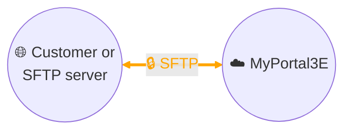

# Data collection - File exchange via SFTP

## Architecture

## Description
Our **MyPortal3E** digital platform enables data exchange with our industrial customers' systems via the **SFTP** (*Secure File Transfer Protocol*) protocol.

This exchange is based on transferring **CSV files** containing business data defined within the customer governance framework.
- Prior to the project, the **exact CSV file format** (structure, headers, separators, frequency) is jointly defined with the customer to ensure interoperability.
- Two exchange modes are possible:
  1. **The industrial customer hosts the SFTP server**: MyPortal3E retrieves the CSV files and then **deletes them after retrieval**, to avoid duplicates or file accumulation.
  2. **MyPortal3E hosts the SFTP service**: the customer acts as an "SFTP client" and regularly pushes new CSV files, thus ensuring **data freshness** on the Portal side.

The **SFTP** protocol ensures exchange security through:
- **communication encryption**, which protects data confidentiality and integrity,
- **strong authentication** (dedicated account, robust password and/or SSH key).

This architecture enables simple and secure integration, while respecting the customer's governance responsibility over the data provided.
