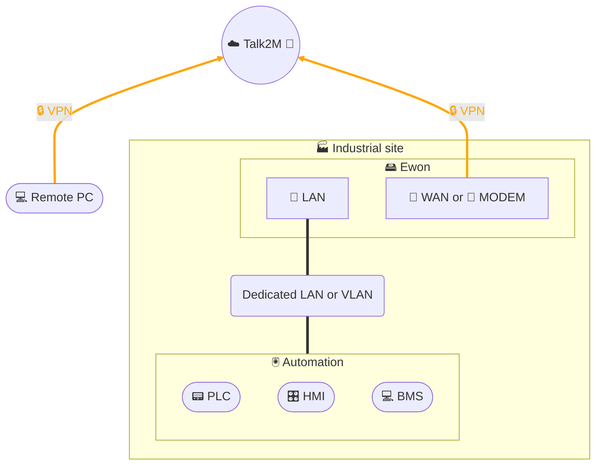

# Remote access - HMS Ewon Talk2M

## Architecture

## Description
This architecture illustrates secure remote access to PLCs via an **Ewon Flexy**.
- The **remote PC** establishes an **encrypted VPN tunnel** to the **Talk2M** platform.
- The Ewon also creates a VPN tunnel (via its WAN interface or 4G modem) to Talk2M.
- The **Talk2M** platform acts as a **secure interconnection service**, playing the role of an **application firewall**:
  - it filters and controls access,
  - it authenticates users,
  - it ensures encryption of communications.
- Once the connection is established, the technician can:
  - **remotely view an HMI or BMS** via **VNC** server, **Web** interface or **RDP** session,
  - **modify a program** with the engineering software installed on their remote workstation.
- The **automation system** remains isolated behind the Ewon, in a dedicated LAN or specific VLAN.
- The strict **LAN / WAN** separation on the Ewon contributes to **network segmentation**.

## Network flows and firewall rules
To secure this architecture, only strictly necessary flows should be allowed:

- **From the Ewon to Internet (WAN)**:
  - DNS (UDP/53) to authorized servers
  - NTP (UDP/123) to a reliable time source
  - VPN (UDP/1194 or TCP/443 depending on configuration) to Talk2M

- **From the remote workstation to Talk2M (Internet)**:
  - VPN (TCP/443) to establish the secure tunnel

- **From the Ewon to the automation LAN**:
  - Industrial protocols used locally (Modbus/TCP 502, ISO-TCP 102, etc.)
  - HMI access (VNC 5900, RDP 3389, HTTP/HTTPS 80/443)

**Applied security principles**:
- Blocking of any other flow not explicitly authorized (*deny all* policy).
- Strict LAN/WAN segmentation at the Ewon level.
- Remote access conditioned on strong authentication (MFA on Talk2M side).
- VPN connection logging and access attempt monitoring.
