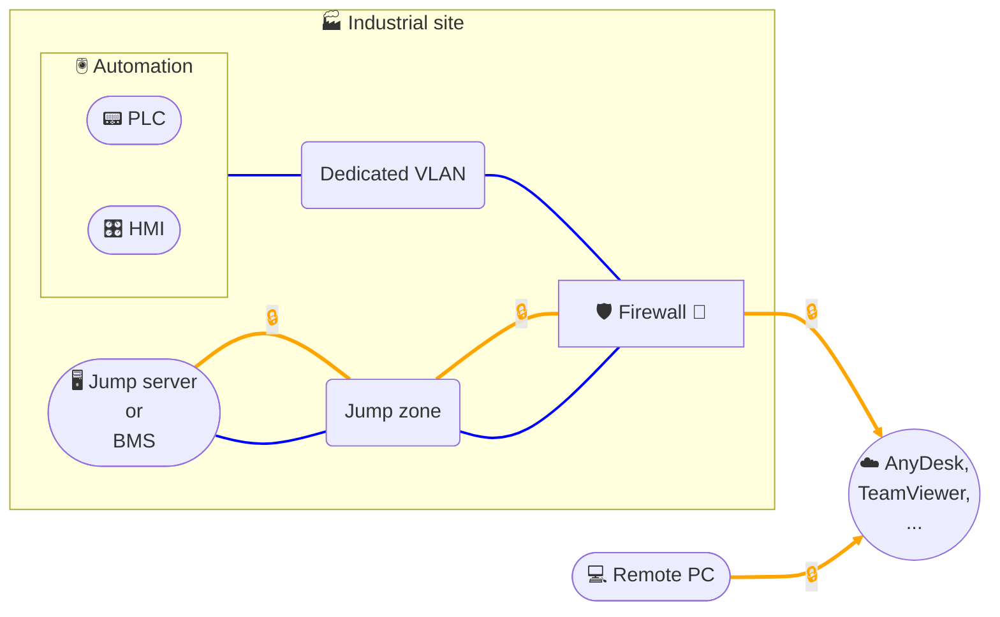

# Remote access - Remote Desktop Software (PMAD)

## Architecture

## Description
This architecture implements **remote desktop access (PMAD)** via a cloud service (e.g., **AnyDesk / TeamViewer**):
- The **remote workstation** establishes an **encrypted PMAD session** to the **cloud service** (access broker).
- The **customer site** also initiates an **encrypted outbound connection** from the **firewall** to the **PMAD service**; no unsolicited incoming flow is required.
- The **jump server** (or the **BMS** if used as an access point) resides in a **dedicated Jump zone for remote access**. Once the session is established by the broker, the technician operates **from this jump server** with the **installed tools** (e.g., VNC client, RDP, web browser, engineering software).
- The **automation equipment** (PLC, HMI) is isolated in a separate **Automation VLAN**; flows from the **Jump zone** to this **Automation VLAN** are **strictly filtered** at the firewall (whitelist by protocol/port/IP).
- Security recommendations: **MFA** on PMAD accounts, **domain/IP restriction** to the PMAD cloud, **session logging**, named accounts on the jump server, and **"deny all" policy** by default with minimal openings on the site side.
