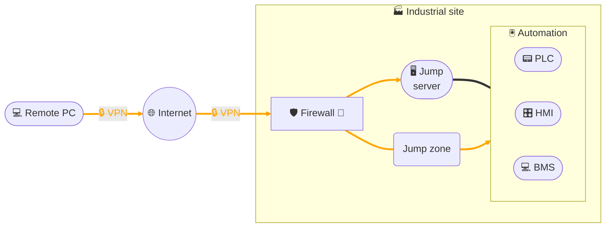

# Remote access - VPN client solution

## Architecture

## Description
This architecture illustrates remote access via **VPN client solution**:
- The **remote workstation** establishes an **encrypted VPN tunnel** to the **customer site firewall**.
- The **firewall** controls and limits incoming flows.
- Access to the automation network is then provided:
  - either via a **dedicated VLAN**, where the technician directly uses their workstation with engineering software to **modify PLC programs** and can access **VNC**, **RDP** and **Web** servers available on this VLAN (PLCs, HMI, local BMS supervision),
  - or via a **jump server**, to which they connect remotely: in this case, the technician is limited to the **tools installed and made available** on this server.
- This segmentation reduces the attack surface and enables **precise flow control by the firewall**.
