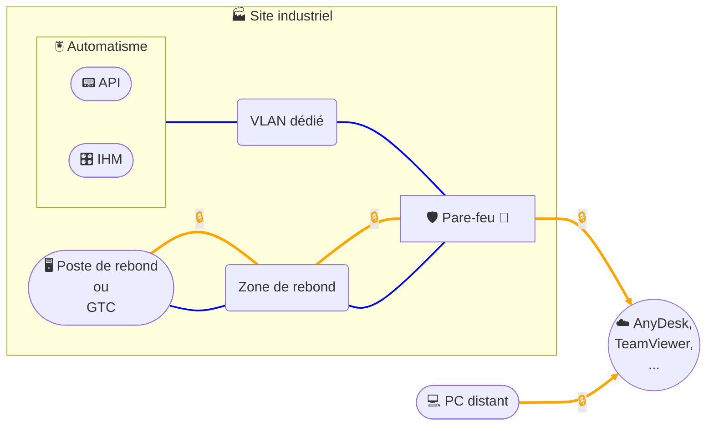

# Accès distant - Logiciel de Prise de Main À Distance (PMAD)

## Architecture

## Description
Cette architecture met en œuvre une **prise en main à distance (PMAD)** via un service cloud (ex. **AnyDesk / TeamViewer**) :  
- Le **poste distant** établit une session **PMAD chiffrée** vers le **service cloud** (courtier d’accès).  
- Le **site client** initie lui aussi une connexion **sortante chiffrée** depuis le **pare-feu** vers le **service PMAD** ; aucun flux entrant non sollicité n’est requis.  
- Le **poste de rebond** (ou la **GTC** si elle sert de point d’appui) réside dans une **Zone de rebond dédiée aux accès distants**. Une fois la session établie par le courtier, l’intervenant agit **depuis ce poste de rebond** avec les **outils installés** (ex. client VNC, RDP, navigateur Web, logiciels d’ingénierie).  
- Les **équipements d’automatisme** (API/PLC, IHM) sont isolés dans un **VLAN Automatisme** distinct ; les flux depuis la **Zone de rebond** vers ce **VLAN Automatisme** sont **strictement filtrés** au pare-feu (liste blanche par protocole/port/IP).  
- Recommandations sécurité : **MFA** sur les comptes PMAD, **restriction par domaine/IP** vers le cloud PMAD, **journalisation** des sessions, comptes nominatifs sur le poste de rebond, et **politique « deny all »** par défaut avec ouvertures minimales côté site.  
