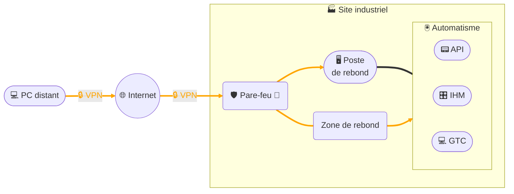

# Accès distant - Solution VPN client

## Architecture

## Description
Cette architecture illustre l’accès distant par **solution VPN client** :  
- Le **poste distant** de l’intervenant établit un tunnel **VPN chiffré** vers le **pare-feu du site client**.  
- Le **pare-feu** contrôle et limite les flux entrants.  
- L’accès au réseau automatisme se fait ensuite :  
  - soit via un **VLAN dédié**, l’intervenant utilise directement son poste avec le logiciel d’ingénierie pour **modifier les programmes automates** et peut accéder aux serveurs **VNC**, **RDP** et **Web** disponibles sur ce VLAN (automates, IHM, supervision locale GTC),  
  - soit via un **poste de rebond**, auquel il se connecte à distance : dans ce cas, l’intervenant est limité aux **outils installés et mis à disposition** sur ce poste.  
- Cette segmentation réduit la surface d’attaque et permet un **contrôle précis des flux par le pare-feu**.

