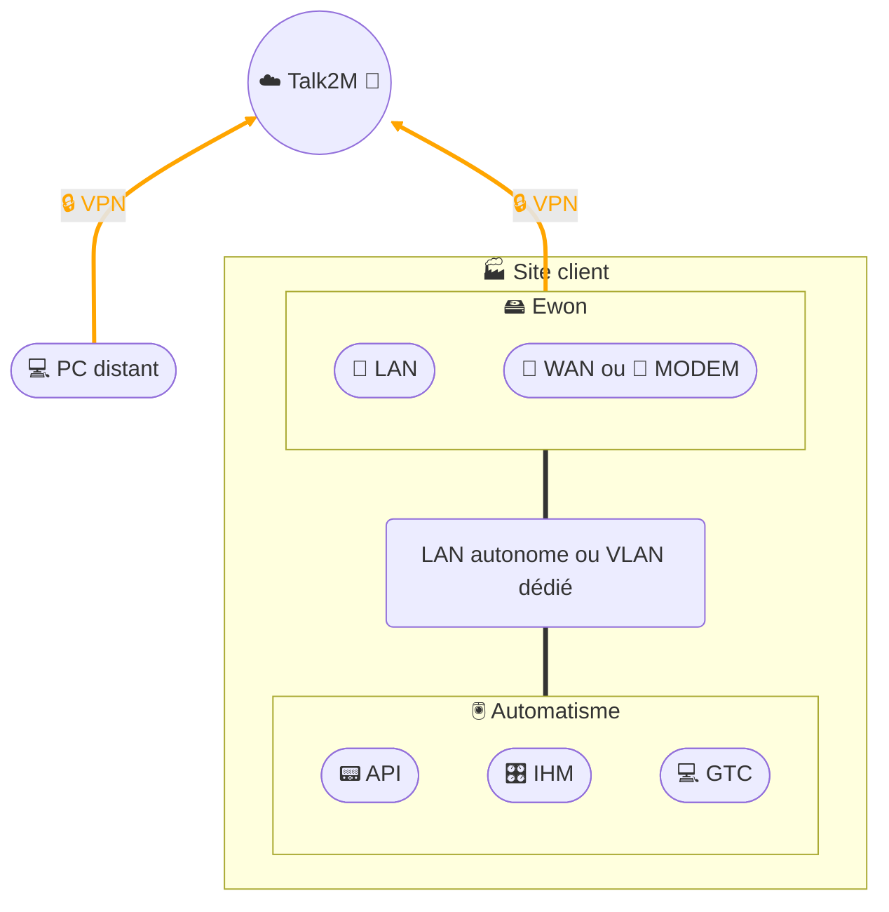

# Accès distant - Ewon

## Architecture

## Description
Cette architecture illustre l’accès distant sécurisé aux automates via un **Ewon Flexy**.  
- Le **PC distant** de l’intervenant établit un tunnel **VPN chiffré** vers la plateforme **Talk2M**.  
- L’Ewon crée lui aussi un tunnel VPN (via son interface WAN ou modem 4G) vers Talk2M.  
- La plateforme **Talk2M** agit comme **service d’interconnexion sécurisé**, en jouant un rôle de **pare-feu applicatif** :  
  - elle filtre et contrôle les accès,  
  - elle authentifie les utilisateurs,  
  - elle assure le chiffrement des communications.  
- Une fois la connexion établie, le technicien peut :  
  - **visualiser à distance une IHM ou une GTC** via serveur **VNC**, interface **Web** ou session **RDP**,  
  - **modifier un programme** avec le logiciel d’ingénierie installé sur son poste distant.  
- L’**automatisme** reste isolé derrière l’Ewon, dans un LAN dédié ou un VLAN spécifique.  
- La séparation stricte **LAN / WAN** sur l’Ewon contribue au **cloisonnement réseau**.  

## Flux réseau et règles de pare-feu
Pour sécuriser cette architecture, seuls les flux strictement nécessaires doivent être autorisés :

- **Depuis l’Ewon vers Internet (WAN)** :  
  - DNS (UDP/53) vers les serveurs autorisés  
  - NTP (UDP/123) vers une source de temps fiable  
  - VPN (UDP/1194 ou TCP/443 selon configuration) vers Talk2M  

- **Depuis le poste distant vers Talk2M (Internet)** :  
  - VPN (TCP/443) pour établir le tunnel sécurisé  

- **Depuis l’Ewon vers le LAN automatisme** :  
  - Protocoles industriels utilisés localement (Modbus/TCP 502, ISO-TCP 102, etc.)  
  - Accès IHM (VNC 5900, RDP 3389, HTTP/HTTPS 80/443)

**Principes de sécurité appliqués** :  
- Blocage de tout autre flux non explicitement autorisé (politique *deny all*).  
- Segmentation stricte LAN/WAN au niveau de l’Ewon.  
- Accès distant conditionné à une authentification forte (MFA côté Talk2M).  
- Journalisation des connexions VPN et supervision des tentatives d’accès.  
