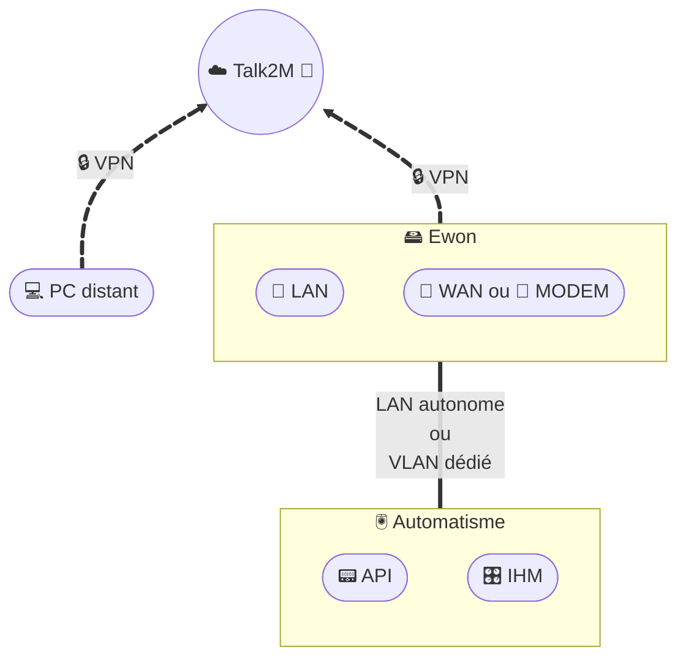

# Accès distant - Ewon

## Description
Cette architecture illustre l’accès distant sécurisé aux automates via un **Ewon Flexy**.  
- Le **PC distant** de l’intervenant établit un tunnel **VPN chiffré** vers la plateforme **Talk2M**.  
- L’Ewon crée lui aussi un tunnel VPN (via son interface WAN ou modem 4G) vers Talk2M.  
- La plateforme **Talk2M** agit comme **service d’interconnexion sécurisé**, en jouant un rôle de **pare-feu applicatif** :  
  - elle filtre et contrôle les accès,  
  - elle authentifie les utilisateurs,  
  - elle assure le chiffrement des communications.  
- L’**automatisme** (API/PLC et IHM) reste isolé derrière l’Ewon, dans un LAN dédié ou un VLAN spécifique à la télémaintenance.  
- La séparation stricte **LAN / WAN** sur l’Ewon contribue au **cloisonnement réseau**.  

## Architecture

### Légende
- 💻 = PC distant (technicien)
- ☁️ = Plateforme Cloud (Talk2M)
- 🧱 = Fonction de sécurité (pare-feu applicatif, contrôle d’accès)
- 🖴 = Ewon (avec séparation LAN/WAN)
- 🔌 = Interfaces réseau (LAN/WAN)
- 📡 = Modem 4G (option WAN)
- 🖲️ = Zone Automatisme
- 🎛️ = IHM
- 📟 = API / Automate
- 🔒 = VPN chiffré

