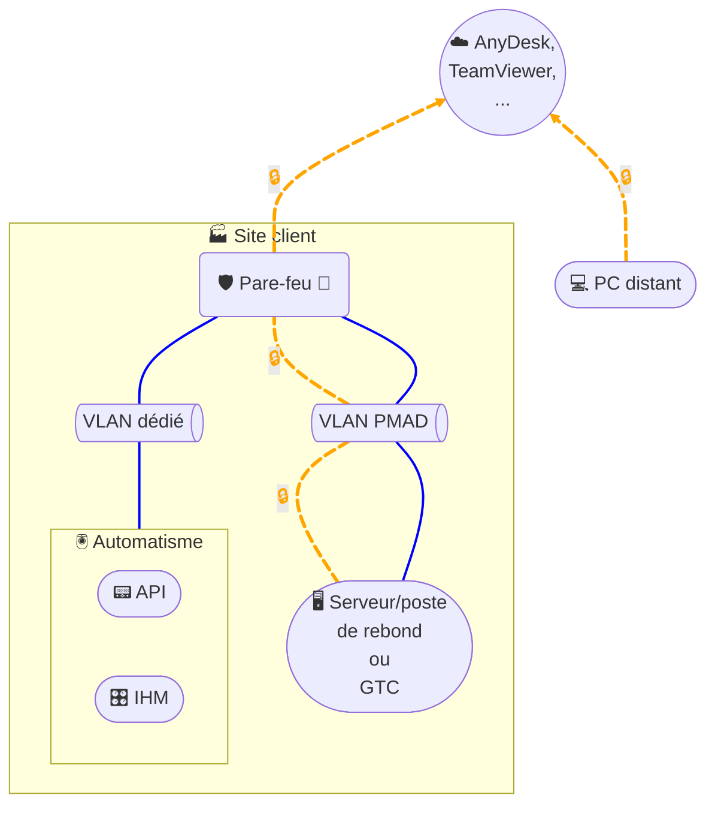

# Accès distant - Logiciel prise de main à distance (PMAD)

## Architecture

### Légende
- 💻 = PC distant (intervenant)
- ☁️ = Service PMAD cloud (AnyDesk / TeamViewer)
- 🏭 = Site client
- 🛡️🧱 = Pare-feu (filtrage, sorties contrôlées)
- 🖥️ = Poste de rebond (ou GTC utilisée comme point d’appui)
- 🖲️ = Zone Automatisme
- 📟 = Automate (API/PLC)
- 🎛️ = IHM
- 🔒 = Lien chiffré (PMAD / VPN / TLS)
- **VLAN PMAD** = Segment dédié aux accès distants (poste de rebond)
- **VLAN dédié** = Segment de la zone Automatisme (équipements industriels)
- **Couleurs de liens (ex.)** : **orange** = liaisons PMAD via Internet ; **bleu** = liaisons internes site (inter-VLAN / LAN)

## Description
Cette architecture met en œuvre une **prise en main à distance (PMAD)** via un service cloud (ex. **AnyDesk / TeamViewer**) :
- Le **poste distant** établit une session **PMAD chiffrée** vers le **service cloud** (courtier d’accès).
- Le **site client** initie lui aussi une connexion **sortante chiffrée** depuis le **pare-feu** vers le **service PMAD** ; aucun flux entrant non sollicité n’est requis.
- Le **poste de rebond** 🖥️ (ou la **GTC** si elle sert de point d’appui) réside dans un **VLAN PMAD** dédié. Une fois la session établie par le courtier, l’intervenant agit **depuis ce poste de rebond** avec les **outils installés** (ex. client VNC, RDP, navigateur Web, logiciels d’ingénierie).
- Les **équipements d’automatisme** (API/PLC, IHM) sont isolés dans un **VLAN dédié** distinct ; les flux depuis le **VLAN PMAD** vers ce **VLAN Automatisme** sont **strictement filtrés** au pare-feu (liste blanche par protocole/port/IP).
- Recommandations sécurité : **MFA** sur les comptes PMAD, **restriction par domaine/IP** vers le cloud PMAD, **journalisation** des sessions, comptes nominatifs sur le poste de rebond, et **politique « deny all »** par défaut avec ouvertures minimales côté site.
