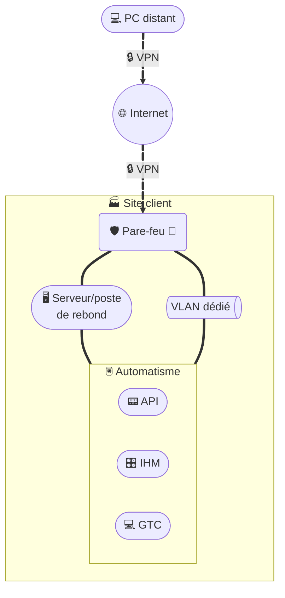

# Accès distant - Solution VPN client

## Architecture

### Légende
- 💻 = PC distant (technicien)  
- 🌐 = Internet  
- 🏭 = Site client  
- 🛡️🧱 = Pare-feu (filtrage, terminaison VPN)  
- 🖥️ = Serveur/poste de rebond (jump server / bastion)  
- 🖲️ = Zone Automatisme  
- 📟 = Automate (API/PLC)  
- 🎛️ = IHM  
- 💻 = GTC (supervision locale)  
- 🔒 = VPN chiffré  
- VLAN dédié = Segment réseau isolé pour la télémaintenance  

## Description
Cette architecture illustre l’accès distant par **solution VPN client** :  
- Le **poste distant** (PC 💻) de l’intervenant établit un tunnel **VPN chiffré** vers le **pare-feu du site client**.  
- Le **pare-feu** contrôle et limite les flux entrants, et termine le tunnel VPN.  
- L’accès au réseau automatisme se fait ensuite :  
  - soit via un **VLAN dédié**, qui isole la télémaintenance dans un segment réseau restreint,  
  - soit via un **serveur de rebond (jump server)** 🖥️, qui joue le rôle de **bastion d’administration** et permet d’accéder aux équipements.  
- Dans la **zone automatisme**, les intervenants peuvent accéder aux automates (📟 API), aux IHM (🎛️), ou à la supervision locale (💻 GTC).  
- Cette segmentation réduit la surface d’attaque et permet un **contrôle précis des flux par le pare-feu**.

