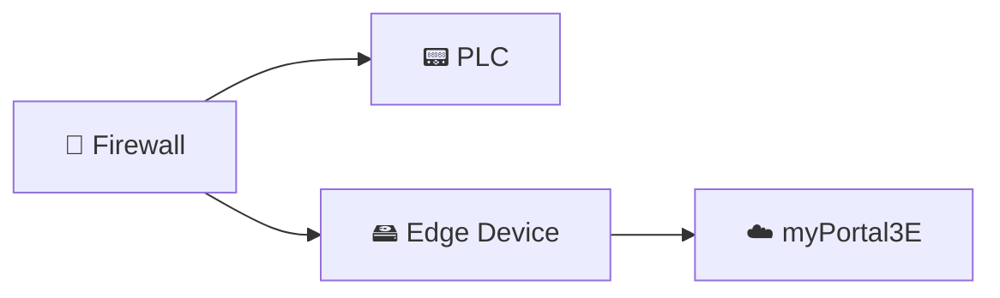
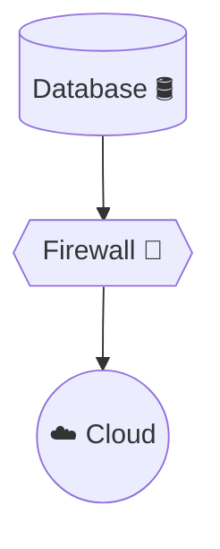
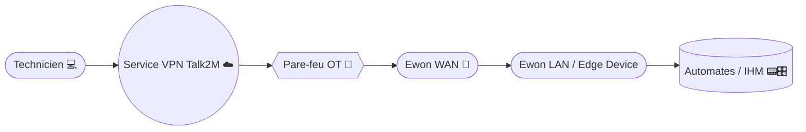
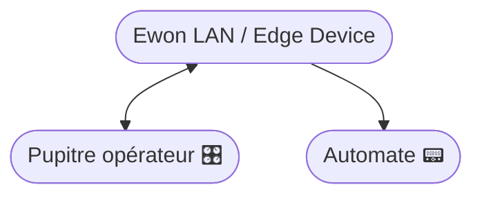
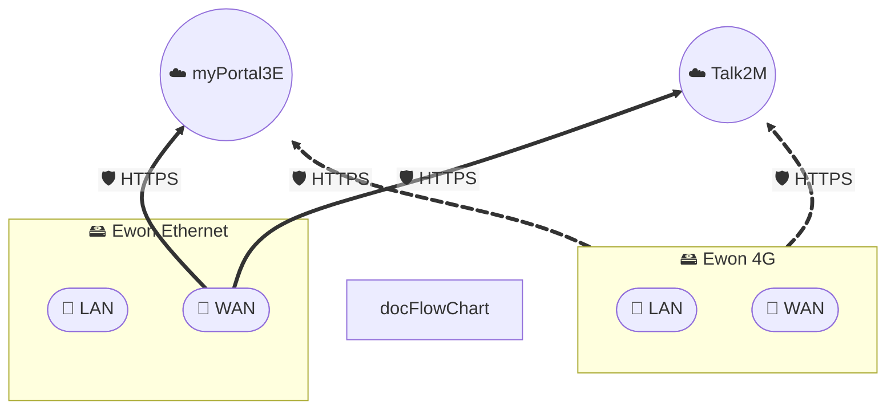

## Légende
- 🖴 = Edge Device (ex. MCD IoT2050)
- 📟 = Automate (PLC)
- 🧱 = Firewall / UTM
- ☁️ = Cloud (myPortal3E, Talk2M)
- 🌐 = Internet / WAN
- 💻 = Poste utilisateur / PMAD
- 🎛️ = IHM

```mermaid
flowchart LR
    fw[🧱 Firewall]
    plc[📟 PLC]
    edge[🖴 Edge Device]
    cloud[☁️ myPortal3E]
    fw --> plc
    fw --> edge
    edge --> cloud
```

```mermaid
flowchart TD
    db[(Database 🛢️)]
    cloud((☁️ Cloud))
    fw{{Firewall 🧱}}
    db --> fw --> cloud
```

```mermaid
flowchart LR
    tech([Technicien 💻])
    vpn((Service VPN Talk2M ☁️))
    fw{{Pare-feu OT 🧱}}
    ewonwan([Ewon WAN 📡])
    ewonlan([Ewon LAN / Edge Device])
    plcs[(Automates / IHM 📟🎛️)]

    tech --> vpn
    vpn --> fw
    fw --> ewonwan
    ewonwan --> ewonlan
    ewonlan --> plcs

```

```mermaid
flowchart TD
    ewon([Ewon LAN / Edge Device])
    ihmi([Pupitre opérateur 🎛️])
    plc([Automate 📟])

    ewon <--> ihmi
    ewon --> plc

```

```mermaid
---
config:
  flowchart:
    htmlLabels: false
---
flowchart BT

    docFlowChart
    click docFlowChart "https://docs.mermaidchart.com/mermaid-oss/syntax/flowchart.html"

    subgraph ewonEth [🖴 Ewon Ethernet]
        ewonLan([🔌 LAN])
        ewonWan([🔌 WAN])
    end

    subgraph ewon4G [🖴 Ewon 4G]
        ewonLan2([🔌 LAN])
        ewonModem([📡 WAN])
    end

    ewonWan & ewon4G e1@== 🛡️ HTTPS ==> myPortal3E((☁️ myPortal3E))
    ewonWan & ewon4G e2@== 🛡️ HTTPS ==> Talk2M((☁️ Talk2M))

    e1@{ animation: fast }
    e2@{ animation: fast }


    %% click myPortal3E callback "Tooltip"
    click myPortal3E "https://v2.myclauger.com/" "This is a tooltip for a link"
    
```